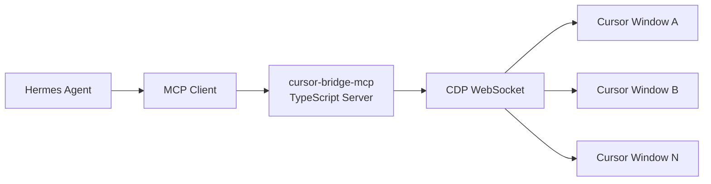
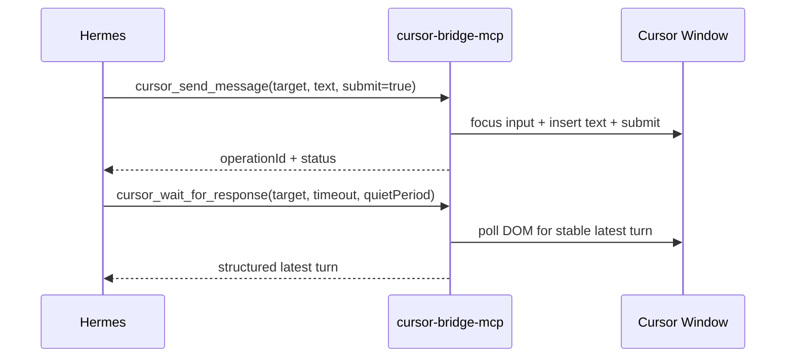

# Cursor Bridge MCP

[](https://github.com/pandaxbacon/cursor-bridge-mcp)
[](https://nodejs.org/)
[](https://www.typescriptlang.org/)
[](https://modelcontextprotocol.io/)
[](./LICENSE)

A TypeScript MCP server that lets Hermes control local Cursor IDE windows through Chrome DevTools Protocol (CDP).

## Why this project

Keep Hermes as the orchestrator, and treat Cursor as a controllable local execution UI:

- discover open Cursor windows/workspaces
- target one specific window/chat
- send prompts
- read and wait for responses
- inspect confirmations safely

No Telegram, no voice stack, no cloud relay.

## System Diagram



## Request Flow Diagram



## Status

Experimental and local-first. Cursor internal DOM selectors are not a stable public API and may change between Cursor versions.

## Core Features

- Multi-window discovery and targeting (`targetId`, alias, workspace path, title fallback)
- Chat tools: list chats, select chat, send message, fetch latest turn, wait for response
- Confirmation visibility + explicit action handling (no silent destructive acceptance)
- Screenshot support via CDP
- Health checks for CDP reachability and selector diagnostics
- Workspace aliasing via `cursor-bridge.config.json`

## Non-goals

- Telegram bot integration
- Voice/transcription/TTS
- Cloud-hosted relay service
- Security bypasses in Cursor
- Auto-accepting destructive actions

## Requirements

- Node.js 20+
- Cursor installed locally
- Cursor launched with a remote debugging port
- MCP-compatible client (Hermes)

## Quick Start

### 1) Install and build

```bash
npm install
npm run build
```

### 2) Launch Cursor with CDP enabled

```bash
cursor --remote-debugging-port=9222 --remote-allow-origins=http://localhost:9222
```

### 3) Run the MCP server

```bash
npm start
# or during development
npm run dev
```

## Hermes MCP Configuration

See `examples/mcp.cursor.example.json`.

```json
{
  "mcpServers": {
    "cursor-bridge": {
      "command": "node",
      "args": ["/absolute/path/to/cursor-bridge-mcp/dist/index.js"],
      "env": {
        "CURSOR_CDP_PORT": "9222"
      }
    }
  }
}
```

## Example Tool Calls

```json
{
  "name": "cursor_list_windows",
  "arguments": {}
}
```

```json
{
  "name": "cursor_send_message",
  "arguments": {
    "target": {
      "workspaceAlias": "loyalty-api"
    },
    "text": "Please run tests and summarize failures.",
    "submit": true
  }
}
```

```json
{
  "name": "cursor_wait_for_response",
  "arguments": {
    "target": {
      "workspaceAlias": "loyalty-api"
    },
    "timeoutMs": 120000,
    "quietPeriodMs": 4000
  }
}
```

## Config: `cursor-bridge.config.json`

Default CDP port is `9222`. You can override with:

- `CURSOR_CDP_PORT`
- per-tool `target.port`
- config file `defaultPort`

Example:

```json
{
  "defaultPort": 9222,
  "aliases": {
    "loyalty-api": {
      "workspacePath": "/Users/me/work/loyalty-api"
    },
    "aem-game": {
      "workspacePath": "/Users/me/work/aem-game"
    }
  },
  "safety": {
    "allowSelfControl": false,
    "confirmationActions": {
      "allowAcceptForLowRisk": true,
      "allowAcceptForMediumRisk": false,
      "allowAcceptForHighRisk": false
    }
  }
}
```

## MCP Tools

- `cursor_list_windows`
- `cursor_describe_window`
- `cursor_list_chats`
- `cursor_select_chat`
- `cursor_send_message`
- `cursor_get_latest_turn`
- `cursor_wait_for_response`
- `cursor_screenshot`
- `cursor_detect_confirmations`
- `cursor_act_on_confirmation`
- `cursor_health_check`

## Safety Model

- Hermes is the controller; Cursor is the controlled target.
- Avoid controlling the same Cursor instance hosting this MCP server workflow.
- Send/read are separate APIs (`cursor_send_message` vs `cursor_wait_for_response`).
- Wait operations are strictly timeout-bounded.
- Per-target operation locks prevent overlapping sends in the same chat path.
- Confirmation actions must be explicit and are policy-gated by risk level.

## Troubleshooting

- **CDP port closed**: start Cursor with remote debugging flags.
- **No windows listed**: verify `http://localhost:9222/json` responds.
- **Selectors broken after Cursor update**: run `cursor_health_check`, then adjust `src/cursor/CursorSelectors.ts`.
- **Text inserted but not submitted**: ensure `submit: true`; verify send-button selector compatibility.
- **Ambiguous target**: specify `targetId` or configure workspace aliases.

## Testing

```bash
npm run test:unit
```

Integration tests are opt-in and non-destructive by default:

```bash
RUN_CURSOR_INTEGRATION=1 npm run test:integration
```

## Development Scripts

- `npm run build`
- `npm run dev`
- `npm start`
- `npm test`
- `npm run test:unit`
- `npm run test:integration`
- `npm run lint`
- `npm run typecheck`
- `npm run format`

## Credits

Cursor CDP bridging ideas were inspired by [pocket-cursor](https://github.com/pandaxbacon/pocket-cursor).

## License

MIT
